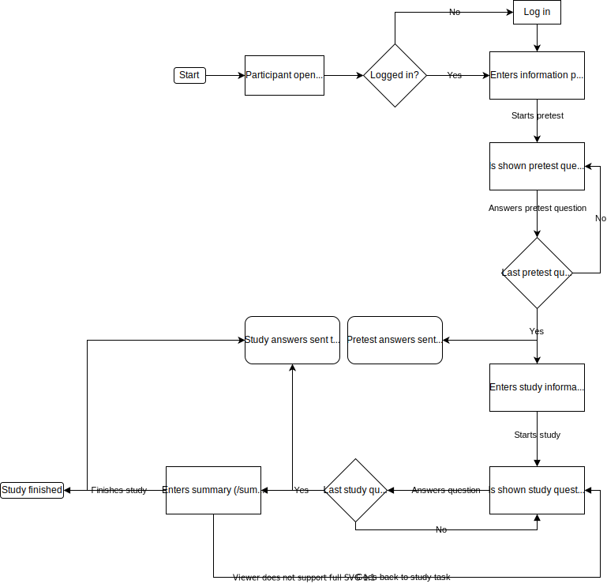

# A master study system for my master thesis

## How to run

Use `npm start` in the project root. The frontend will then start. You'll also need the [backend](https://github.com/skanin/master-study-system-backend) to be able to use the system.

Once both frontend and backend are running, you can use the app at [http://localhost:3000](http://localhost:3000). The backend will be running at [http://localhost:3001](http://localhost:3001). You'll have to login, a list of usernames can be found in the [backend repository](https://github.com/skanin/master-study-system-backend).

## Flow chart of the system

## List of logs events and data that are stored

### Log events

#### login - Participant logs in

-   `subject : int`, `helpType : int`, `username : string`, `time : int` (ms)

#### startPretest - Participant starts the pretest

-   `subject : int`, `helpType : int`, `username : string`, `time : int` (ms)

#### startStudy - Participants starts the study

-   `subject : int`, `helpType : int`, `username : string`, `time : int` (ms)

#### play - Participant plays help video

-   `subject : int`, `helpType : int`, `username : string`, `time : int` (ms), `videoTime : int` (s), `taskId : int`

#### pause - Participant pauses help video

-   `subject : int`, `helpType : int`, `username : string`, `time : int` (ms), `videoTime : int` (s), `taskId : int`

#### disappearValueChange - Participant changes eye gaze disappearance rate

-   `subject : int`, `helpType : int`, `username : string`, `time : int` (ms), `from : int` (s), `to : int` (s), `taskId : int`

#### playTimeValueChange - Participant changes help video time

-   `subject : int`, `helpType : int`, `username : string`, `time : int` (ms), `from : int`(s), `to : int` (s), `taskId : int`

#### pretestAnswerChange - Participant changes pretest answer

-   `subject : int`, `helpType : int`, `username : string`, `time : int` (ms), `pretestId : int`, `pretestQuestion : string`, `pretestAnswer : int`

#### changePretest - Participants changes pretest task

-   `subject : int`, `helpType : int`, `username : string`, `time : int` (ms), `from : int` (taskId), `to : int` (taskId)

#### pretestFinished - Participant finished pretest

-   `subject : int`, `helpType : int`, `username : string`, `time : int` (ms)

#### studyFinished - Participant finished study

-   `subject : int`, `helpType : int`, `username : string`, `time : int` (ms)

#### changeStudy - Patricipant changes study task

-   `subject : int`, `helpType : int`, `username : string`, `time : int` (ms), `to : int` (taskId), `from : int` (taskId)

#### showHelp - Participants shows help video

-   `subject : int`, `helpType : int`, `username : string`, `time : int` (ms), `taskId : int`

#### hideHelp - Participant hides help video

-   `subject : int`, `helpType : int`, `username : string`, `time : int` (ms), `taskId : int`

#### expertProceed - Expert proceeds to next task

-   `subject : int`, `helpType : int`, `username : string`, `time : int` (ms)

#### expertFinished - Expert is finished

-   `subject : int`, `helpType : int`, `username : string`, `time : int` (ms)

#### backToStudyTask - Participant goes back to a study task form Summary page

-   `subject : int`, `helpType : int`, `username : string`, `time : int` (ms), `to : int` (taskId)

#### onFinishSummaryClick - Participant click finish study button

-   `subject : int`, `helpType : int`, `username : string`, `time : int` (ms)

#### finishSummary - Participant finished study

-   `subject : int`, `helpType : int`, `username : string`, `time : int` (ms)

#### logout - Participant logs out

-   `subject : int`, `helpType : int`, `username : string`, `time : int` (ms)

### Data - pretest

#### subjectId

`int`

#### username

`string`

#### pretest.1-1

`int`

#### pretest.1-1_correct

`int`

#### pretest.2-1

`int`

#### pretest.2-1_correct

`int`

#### pretest.3-1

`int`

#### pretest.3-1_correct

`int`

#### pretest.4-1

`int`

#### pretest.4-1_correct

`int`

#### pretest.5-1

`int`

#### pretest.5-1_correct

`int`

#### pretest.6-1

`int`

#### pretest.6-1_correct

`int`

#### pretest.7-1

`int`

#### pretest.7-1_correct

`int`

#### pretest.8-1

`int`

#### pretest.8-1_correct

`int`

#### pretest.9-1

`int`

#### pretest.9-1_correct

`int`

#### pretest.10-1

`int`

#### pretest.10-1_correct

`int`

### Data - study

#### subjectId

`int`

#### username

`string`

#### studyTask1

`string`

#### studyTask2

`string`

#### studyTask3

`string`

#### studyTask4

`string`

#### studyTask5

`string`

#### studyTask6

`string`
